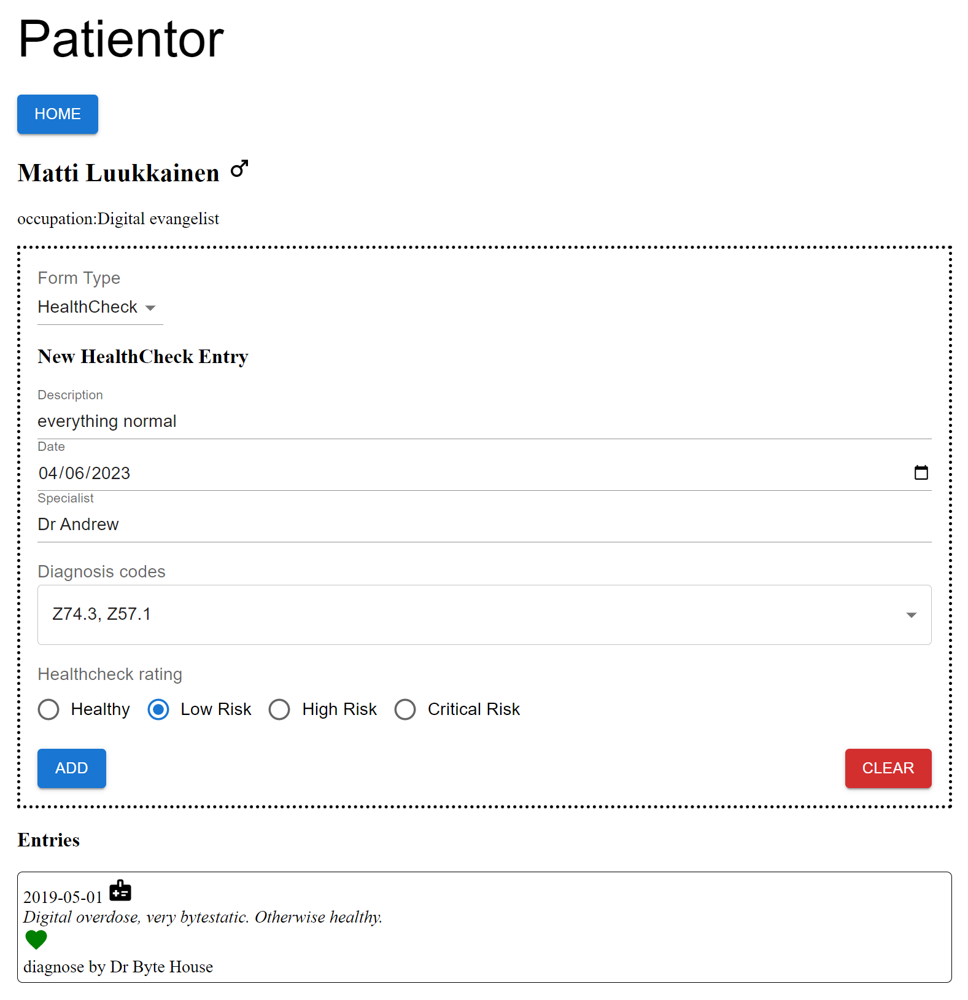

# Patientor - frontend

The exercises for the Patientor frontend primarily focused on building the individual page for each patient on the list stored in the backend. On this page, users could view a patient's information and recorded entries, and add a new entry among various types to an existing patient.

## Preview

This project was bootstrapped with [Create React App](https://github.com/facebook/create-react-app).

## Available Scripts

In the project directory, you can run:

### `npm install`

Install the project dependencies.

### `npm start`

Runs the app in the development mode. 
Open [http://localhost:3000](http://localhost:3000) to view it in the browser.

The page will reload if you make edits. 
You will also see any lint errors in the console.